photoVideoSystemize
===================

Systematization of local photo and video files.
Renaming, geolocation, sorting, correcting the date and time of shooting photo and video files.

# Functionality and features

1. `Rename.` Sort by shooting time and rename files according to data from **matadata** tags according to a user-defined template. 
2. `Time adjustment.` If there are tracks in **.gpx** format and photos from devices without geolocation and with incorrectly configured clocks, under certain circumstances, the script can help calculate the time shift and take it into account when naming files in the folder. This situation occurs when the exact time in the camera is not set or is not translated after moving to another time zone, as often happens. If this error is not corrected, photos from different devices taken at the same time will be named incorrectly and the photos in the folder will be mixed up.
3. `Determination of coordinates.` If you have a geo-track and the correct photographing time, you can determine the approximate coordinates of the shooting location. To determine the coordinates, it is also possible to use photos adjacent in time with a known geolocation. As an option, it is possible to prescribe the median value of coordinates for the current folder to photos or to prescribe one specific value of coordinates and height above sea level to all photos without geo-information.
4. `Groups of files.` When processing, it is possible to process groups of files related to one photo or video. For example:
    >name1.nef + name1.jpg + name1.xmp → name2.nef + name2.jpg + name2.xmp
5. `Separating by date.` Moving of files that do not meet the criteria into separate folders within the processed folder.
6. `Setting up changes.` It is possible to customize the manipulations performed from the complete prescribing of everything to a test run with logging, but without changing the media files themselves. All settings are in a separate file. `'pvs_settings.json'`
7. `Data sources.` The systematization uses a number of data sources to adjust the creation time of the media file and its geolocation:
   - EXIF data of the file itself.
   - File with manual settings: file name, coordinates, creation time, geo_object name, time zone.
   - MacOS tags: coordinates, creation time, geo_object name, time zone
   - Local file 'myplaces.kml' of the Google Earth Pro application: geo objects with coordinates.
8. `What the script changes.` The main goal is not to lose existing data about media files. All changes are made only in the following places:
   - File name.
   - One metadata tag, whose name is specified in the `'script_data_tag_name'` configuration parameter. In this tag all the information necessary for the script is stored.
   - EXIF geolocation data: latitude, longitude, altitude. Particular attention is paid to saving the original coordinates in the files, that is, the coordinates are written to the file or deleted from the file only if these are coordinates previously calculated by this script. A sign of such coordinates is the `'coord_source'` parameter specified in the `'script_data_tag_name'` tag in EXIF. This restriction applies only to the `'sys'` systematization process, when using the `'tool'` utilities, coordinates can be deleted regardless of their origin.
   - MacOS tags. In the case of macOS, according to the preset settings, it is possible to mark files with certain tags, which can be convenient when setting processing parameters for a specific folder or controlling the results of the script.
9. `Multiprocess calculations.` The script uses parallel computing in terms of making changes to EXIF tags.
10. `Multi-folder mode.` The systematization process is performed recursively. It can be run on a large number of folders - the current folder and all its subfolders are processed. Subfolders whose names begin with a specific custom string are ignored during recursive processing. If the process is interrupted, it is possible to resume from the folder where the process was interrupted. In each separate folder, it is possible to save individual local settings for a specific folder in a file.
11. `Logging.` All significant data manipulations are logged and/or printed on the screen. It is possible to flexibly configure the logged information.
12. `Cameras.` When running, the script tries to separate photos by what [device](readme.md#Photo-video-device) they were taken according to the "cameras" parameter in the settings.
13. `SI system.` For all calculations and settings, the values use the international SI system - meters.
14. `Related tasks` are solved by ready-made free specialized tools:
    - For reading and changing metadata in file is used [ExifTool](https://exiftool.org/).
    - For creation, modification and storage of information about geo objects is used [Google Earth Pro](https://www.google.com/intl/en_ALL/earth/about/versions/).

# Installation
1. Install ExifTool. https://exiftool.org/install.html
2. Install Python3. https://www.python.org/downloads/

    The script was tested on python version 3.10

3. Create a virtual environment. https://docs.python.org/3/tutorial/venv.html
4. install python packages:
   - for macOS: 
     > pip3 install -r requirements_macos.txt
   - for other os:
     > pip3 install -r requirements.txt

# Version
If you want to view the version of photoVideoSystemize:
> python3  pvs.py { -v | -version }

# Systematization usage
Systematization is started using the sys command.

Start with current parameters in the settings file: 
> python3 pvs.py sys <start_folder>

Start new job: 
> python3 pvs.py sys <start_folder> -rec -new

Continue the interrupted previous job only with renaming and obtaining exact coordinates: 
> python3 pvs.py sys <start_folder> -con -mode only_rename exact_get

# [Tools](readme.md#Tools)

# How it works
## Settings
The script uses 4 levels of settings with different priorities. The value of any parameter can be replaced at a higher priority level:
1. General settings. The lowest level. They are stored in the `'pvs_settings.json'` file. All parameters are required. Convenient to set up once the most frequently used. The structure of the file is unchanged in terms of the composition of the parameters.
2. Each time the systematization is started, it is possible to specify the operating mode. Mode is a string name of a set of parameters that can be specified in advance in the `'pvs_mode_preset.json'` file.
   In fact, the name and the corresponding set of parameters are specified in the parameter set, which override the values of the main settings, for example, if it is required to use a group of different parameters temporarily during one launch with one parameter.
   `pvs_mode_preset.json:`

    > {
    > 
    > "mode1_name”: { <some parameters 1>},
    > 
    > “mode2_name”: { <some parameters 2>}
    > 
    > }

   `-mode`The mode names are specified at startup and are applied sequentially in the order specified in the `-mode` parameter:
    > python3 pvs.py sys <start_folder> -mode mode1_name mode2_name ...
 
    It is possible independently create convenient and most frequently used parameter sets by saving them in a file `'pvs_mode_preset.json'`.
3. Options relating to each specific folder. If individual settings for a particular folder are required,  they can be stored in a file with the name specified in the main settings in the `'folder_settings_file'` parameter. If no value is specified in the settings, the script looks in each folder for a settings file with the name `'_pvs_folder_settings.json'`. It is convenient if you need to run the systematization process several times when adding new files, especially when the process is launched simultaneously on several folders at the same time with different settings.
4. Parameters specified when running the script, except for the `-mode` parameter. For example:
    > python3 pvs.py sys <start_folder> -new
   
    `-rec` Recurrent run. After the algorithm completes in the current folder, the same mechanism is recursively run for all child folders, except for those folders whose name begins with the string specified in the "ignore_sing" configuration parameter. Actually `-rec` set the `'recurrent'` parameter in the settings to the `'true'` for current launch.

    `-rec_all` Recurrent run. After the algorithm completes in the current folder, the same mechanism is recursively launched for all child folders, unlike `-rec`, the launch is carried out for all folders without taking into account "ignore_sing", which is reset to `''` for the current run.

    `-no_rec` Prohibit recurrent run. Set the `'recurrent'` parameter in the settings to the `false` for the current run.

    `-con` Continue the previous interrupted job. Process is carried out over all unprocessed in the previous script run. Folders worked out in the previous run are not processed.

    `-new` Start new job for all folders, regardless of the results of the previous run.

Parameters in settings are disabled by adding a `'-'` sign in front of the parameter name or value.
When parameters are loaded, a check is made for the structure of settings and types of parameter values. To turn off the parameter, you should not delete it - just deactivate `‘-’`. Deactivation does not apply to boolean and numeric parameters.
If 2 mutually exclusive parameters are specified, for example `'-rename_print'` and `'rename_print'`, the script will decide in favor of the `'rename_print'` feature, ignoring `'-rename_print'`.

## Storing script data in media files
For the script to work correctly, it is necessary to [store](readme.md#Script-data) some information for each file. It is convenient to do this with one of metadata tags. The name of this tag is determined by the 'script_data_tag_name' settings parameter.
If `'script_data_tag_name'` setting parameter is left blank, the default value of `'XMP:UserComment'` is taken.

**The `'script_data_tag_name'` parameter is recommended to be selected once and not changed in the future.** When changing the script data storage tag, information about the source of coordinates will be lost if the coordinates were calculated earlier, and not received by the device at the time of photographing.

The author found the following tags for storing script information:

        'script_data_tag_name': 'XMP:UserComment'
or

        'script_data_tag_name': 'XMP:Description'

The given variants of tags are not supported by .avi and .bmp files. At least on those files that the author tested.

An example of filling the script data tag:

    {
        'pvs': '1.01',
        'dt': '2016:08:11 14:46:02', 
        'dt_source': 'exif', 
        't_zone': 'Europe/Rome', 
        'utc_dt': '2016:08:11 11:46:03', 
        'coord_source': 'geo_track', 
        'address': {'historic': "Basilica di Sant'Apollinare Nuovo", 
                    'road': 'Via San Giovanni Bosco', 
                    'quarter': 'Borgo San Rocco', 
                    'city': 'Ravenna', 
                    'county': 'Ravenna',
                    'state': 'Emilia-Romagna', 
                    'postcode': '48121', 
                    'country': 'Italia', 
                    'country_code': 'it', 
                    'source': 'osm'}, 
        'first_dt': '2016:08:11 14:46:02', 
        'camera': 'NIKON_D300',
        'gr_id': '80609d14-259f-459c-b690-46224336adac', 
        'f_id': 'c1ac1eef-3098-46a6-a296-e641349460b4'
    }

## Brief description of the Systematization process
### Loading and processing data

- All files of the types specified in the `'media_types'` and `'add_types'` parameters are read in the current folder. All files are [grouped](readme.md#Grouping-files-by-templates) according to the features specified by the `'masters'`, `'slaves'`, `'additions'`, `'non_pair'` settings. Metadata is read from files collected in groups, and then all calculations are carried out over groups of files. Only at the end of the process, if the corresponding settings are activated, the results obtained are written to the source files. 
- According to the `'time_shift_by_settings'` parameters in the settings for certain groups, the script [applies](readme.md#Making-changes-to-the-file-creation-time-according-to-the-setting) a time shift to the creation date and time, if this shift is known in advance. Unfortunately, this parameter is often unknown and requires a separate calculation.
- If the `'get'` settings parameter contains the value `'get_file_data_from_manual_file'`, then in the current folder look for a file with the name specified in the `'manual_data_file'` parameter. From it the data for manual modification is [loaded](readme.md#Getting-manual-information-from-data-manual_data_file) and applied to all corresponding file groups. For example, if necessary, some reference groups to prescribe the coordinates for calibrating the camera clock.
- If the `'get'` settings parameter contains the value `'get_file_data_by_file_tags'`, then all file groups are processed with their text tags. So far, only macOS tags have been processed in the script. The data from the [tags](readme.md#Getting-manual-information-from-file-tags) is similar in meaning to the data from the `'manual_data_file'` file - the specified information about the file creation time, its coordinates or time zone is taken by hand into file groups.
- If the `'get'` settings parameter contains the value `'get_coord_by_geo_object'`, then when processing manual data from the `'manual_data_file'` file or from tags, if there is no information about coordinates, try to search by the name of the [geo_object](readme.md#Directory-of-geo-objects). At the moment, this information is loaded from the local [Google Earth Pro](https://www.google.com/intl/en_ALL/earth/about/versions/) application.
- If the `'get'` settings parameter contains the value `'get_coord_by_gpx_file'`, then all files with the .gpx extension are loaded from the current folder and, using the calculated UTC time of creating media files, the geolocation of the shooting is [calculated](readme.md#Calculation-of-coordinates-by-GPS-track) for each group.
- If the `'get'` settings parameter contains the value `'get_utc_calibrate_by_track'`, then before determining their geolocation from tracks from `‘.gpx’` files, the script will attempt to calculate and apply a corrective [clock shift](readme.md#Clock-calibration-by-reference-photos) for individual [cameras](readme.md#Photo-video-device).
- For all file groups, according to the `'folder_dt_name_format'` parameter in the settings, [calculating](readme.md#Filtering-groups-based-on-grouping-by-folders) the sign of grouping by folders.
- If the `'sort_files'` settings parameter contains the value `'true'`, then the script compares the attribute of grouping by folders with the name of the current processed folder. If the folder name does not contain a calculated attribute, then all files of this group are transferred to a subfolder of the current folder with the name of this attribute.
- If the `'get'` settings parameter contains the value `'get_t_zone_by_neighbors'`, then for all groups without time zone information, the zone information is [calculated](readme.md#Calculation-of-the-time-zone-by-neighboring-groups) from the groups with time zone information adjacent in time.
- If the `'get'` settings parameter contains the value `'get_coord_by_neighbors'`, then for all groups without information about coordinates, the script [takes](readme.md#Calculation-of-coordinates-of-groups-by-neighboring-groups) information from groups adjacent in time with coordinates information. In fact, coordinates are determined in the same way as coordinates are determined by a geo-track, but photos with coordinates from the current folder are selected as a track.
- If the `'get'` settings parameter contains the value `'get_begin_coord_by_first_neighbor'`, then the coordinates from the first group of files with coordinates are [applied](readme.md#Get-coordinates-of-groups-at-the-beginning-of-the-folder) to all groups preceding in time.
- If the `'get'` settings parameter contains the value `'get_end_coord_by_last_neighbor'`, then the coordinates from the last group of files with coordinates are [applied](readme.md#Get-coordinates-of-groups-at-the-end-of-the-folder) to all later groups.
- If the value `'get_median_coord'` is specified in the `'get'` settings parameter, then the median value is [calculated](readme.md#Calculation-of-median-coordinates) for all groups with coordinates in the folder and assigned to groups without geolocation.
- If the value `'get_common_data_from_manual_file'` is specified in the `'get'` settings parameter, then in the current folder the script is looking for a file with the name specified in the 'manual_data_file' parameter. In this file script is looking for value `‘All’` with coordinates or a time zone and is [assigned](readme.md#Application-of-single-manual-data-for-all-groups-without-coordinates-or-without-time-zone) to groups without geolocation or without a time zone.
- After calculating the information about the creation time of the groups and sorting according to the received UTC creation time, the script numbers the groups. Each group is assigned a sequential number in string format. The number of digits for the number is calculated from the number of groups. The first empty digits are filled with zeros.
- If the `'get'` settings parameter contains the value `'get_address'`, then for all groups with information about the geolocation, the script [calculates](readme.md#Calculation-the-address-by-coordinates) the postal address. At the moment, the address is loaded from the public service [OpenStreetMap](https://www.openstreetmap.org/).
- Groups are sorted according to the calculated `UTC time`. If for some groups it was not possible to get the UTC time, then for those groups the time of creating the media file is taken as a sorting key. This is a very rough approximation, but if the groups are given information about the time zone, then this collision can mostly be avoided.
- Further, for each file (not group), according to the settings and the calculated creation UTC data of the group, a new file name is [calculated](readme.md#Computing-a-new-filename-and-rename).
- If the `'get'` settings parameter contains the value `'get_unique_id'`, then for all groups with empty unique group number values and for all files with empty unique file number values, the corresponding new unique values are calculated and stored in the script data in the metadata of each file. The mechanism is added for the future. There is currently no use for it.
### Applying the calculated data to the files in the current folder

- If the `'set'` settings parameter contains the value `'mac_tags_set'` and the operating system is `macOS` then according to the settings and the various values obtained for each file, the corresponding tags are [added](readme.md#Creating-macOS-tags) to the `macOs` Finder tags. This is convenient when setting folder processing parameters, and after obtaining optimal results, you can leave only those tags that are convenient for further storage and viewing of photo / video materials.
- If the `'set'` settings parameter contains the value `'exif_set'`, the computed values of coordinates, addresses, and other data are [stored](readme.md#Reading-and-making-changes-to-the-metadata-section-of-files) in the metadata  section of each file in each group.
- If the `'set'` settings parameter contains the value `'rename_set'`, then the script [changes](readme.md#Computing-a-new-filename-and-rename) all files in the folder according to the calculated new names.
- After finishing work on the current folder, its path is added to the file specified in the settings in the `'done_folders_pickle_file_path'` parameter and `'done_folders_txt_file_path'` in text form - for the convenience of subsequent control of the results of the script.
**Attention** – when the script is run in continue mode, the information about used folders is read by the script from the `‘done_folders_pickle_file_path’` file. If the parameters `'done_folders_pickle_file_path'` and `'done_folders_txt_file_path'` are not filled in, then the default value is applied: `'data/pvs_done_folders_list.txt'` and `'data/pvs_done_folders_list.pickle'` respectively.
- If the `'create_exist_track'` parameter in the settings contains `'true'` and the `'exist_pv_gpx_track_file'` parameter is filled in, then a track file is created in the current folder from all photos with geolocation information. If the `‘split_exist_track_by_cameras’` parameter in the settings contains `'true'`, then the created file will be split into tracks - one track for each [camera](readme.md#Photo-video-device).
- If the `'save_all_by_hand_file_data'` parameter in the settings contains `'true'`, then all manual data received from other sources are saved in the `'manual_data_file'` file. 
- When renaming photo / video files, the data in the `'manual_data_file'` file in part of the file names also changes to the new ones.
- If the `'log_mode'` settings parameter contains the value `'result_log'` and/or `'result_print'`, then the last analysis of the results is [output](readme.md#Checking-the-results-and-printing-them) to the log and/or screen based on the parameters.
- If the `'recurrent'` parameter in the settings contains `'true'`, then after the processing of the current folder is finished, the process starts for all subfolders. In this case, subfolders whose name begins with the string specified in the `'ignore_sing'` settings parameter are ignored and the process is not started on them. In this case if `'ignore_sing'` is `''`, the new process starts for all subfolders.

## Grouping files by templates
Often, photos or videos in different devices are created in pairs: `name.nef + name.jpg` or `name.mov + name.jpg`. Or sometimes groups of files are created during processing: `name.jpg + name_small.jpg + name_big.jpg + name.xmp`. Script allows this type of file grouping. The number of files in a group is unlimited and configurable. 
Renaming and processing occurs entirely for the entire group:

        name1.nef + name1.jpg + name1.xmp → name2.nef + name2.jpg + name2.xmp

When loading files from a folder, files with types from the `'media_types'` parameter are loaded first. For each file, the templates from the `'masters'` configuration option are applied:

    "masters": {
        "(.*).NEF$": {     ← pattern in regular expression format
            "prefix": "",   ← prefix for a new name
            "suffix": "",   ← suffix for a new name
            "ext": ""       ← extension for a new name
        },
        "(.*).DNG$": {
            "prefix": "",
            "suffix": "",
            "ext": ""
        }
    }
If the `'group_pattern_case_sensitive'` settings parameter is set to `'true'`, then the patterns will be case-sensitive for the file name and extension and the pattern. If `'false'` is specified, then it is not case-sensitive.
If there are files that match the patterns 'masters', then groups are created for each of them.

Next, the script checks all the remaining files in the same way for matching the `‘slaves’` templates:

    "slaves": {
        "^(.*)_small.jpg$": {
            prefix: "",
            "suffix": "_small",
            "ext": ""
        },
        "^print_(.*).jpeg$": {
            "prefix": "print",
            "suffix": "",
            "ext": ".jpg"
        },
        "^(.*).psd$": {
            prefix: "",
            "suffix": "",
            "ext": ""
        }
    }

If there are files that give a non-zero result for the patterns `'slaves'`, the script looks for created groups that for `'masters'` gave a similar result using the regular expression. If such a group is found, then add the current file to the found group. If there is more than one suitable group, then the processing of the folder is interrupted - this situation is not provided and the settings should be changed.
If no matching `'slaves'` template is found, or if no matching group is found for it, then such a file forms its own group with settings:

    "non_pair": {
        prefix: "",
        "suffix": ""
    }

Next, files with types from the `'add_types'` parameter are loaded.
For all these files, in the same way as for 'slaves', templates from the `'additions'` parameter are applied:

    "additions": {
        "(.*).xmp$": {
            prefix: "",
            "suffix": "",
            "ext": ""
        }
    }

If there are files that give a non-zero result for the `'additions'` patterns, the script looks for created groups that for `'masters'` gave a similar result of applying the regular expression. If such a group is found, then add the current file to the found group. If there is more than one suitable group, then the processing of the folder is interrupted - this situation is not provided and the settings should be changed.
If no matching `'additions'` pattern is found, or found but no matching group found for it, then the file is ignored and not processed.
For the given example of templates in the processed folder, the following files will be found and collected in one group, for example:

    2002_10_23-10_15.NEF
    2002_10_23-10_15_small.JPG
    print_2002_10_23-10_15.jpeg
    2002_10_23-10_15.XMP

## Determining the date and time the photo/video file was created
For determining the date of photo/video, first an attempt is made to take this information from metadata of the file, if it is impossible the date of creation is taken os file properties. To read and change file metadata, the [ExifTool](https://exiftool.org) package is used.
When determining the date and time from metadata, the tags are iterated over the list from the `'EXIF_create_dt_tag_name'` setting parameter. The search is carried out in the order specified in the list. When a valid value is found, the list search stops.

## Making changes to the file creation time according to the setting
Sometimes it happens that when taking a photo, the time on the photo / video device is set incorrectly. Then it will not be possible to determine the shooting location from the photos and the geotrack, or the photo / video materials from different devices folded in one place will not go sequentially as they were created, but with a time shift by the amount of the error in setting the clock. Such collections from different sources in this case will look mixed.
Sometimes, after shooting, it becomes known what error was in a particular photo / video device. In this case, when naming files for each specific device, you can make an amendment.
The device detection method will be described separately.
In the `'time_shift_by_settings'` -> `'camera_key_shift' setting'`, it is possible to specify a specific device and the time by which the shooting time should be shifted:

    "time_shift_by_settings": {
        "camera_key_shift": {
            "NIKON_D300": {
                "days": 0
                "hours": 6
                "minutes": 0,
                "seconds": 0
            },
            "NIKON_D60": {
                "days": 0
                "hours": -8,
                "minutes": -5,
                "seconds": 0
            }
        }
    }
In this example, the time of all NIKON_D300 photos will be extended by 6 hours, and NIKON_D60 will be reduced by 8 hours and 5 minutes.
If `'time_shift_by_settings'` is set to the camera quality as `'All'`, then regardless of the other devices mentioned, the time shift will be applied to all groups of files, regardless of the device.

In this case, the value `'by_hand'` will be placed in the script data tag for the `'dt_source'` key.

## Photo video device
Since there is no single field in EXIF to identify a device (at least the author does not know it), it is proposed to add a list of fields in the settings that may contain distinguishing features of devices in order to determine a specific device - the `'EXIF_camera_id_tags_names'` settings parameter. The `'cameras'` parameter is also created in the settings, in which you can specify the devices used, the photos of which should be differentiated during systematization:

    {
        "EXIF_camera_id_tags_names": [
            "EXIF:Model",
            "EXIF:LensInfo",
             "XMP:CameraProfileDigest",
             "XMP:Model",
             "XMP:SerialNumber",
             "MakerNotes:CanonModelID",
             "MakerNotes:CameraID",
             "MakerNotes:CameraType",
             "MakerNotes:SerialNumber",
             "MakerNotes:InternalSerialNumber",
             "MakerNotes:CanonModelID"
        ],
        "cameras": {
            "NIKON_D300": {
                "synthetic_ids": [
                    "NIKON D300"
                ],
                "geo_info": "no_geo"
            },
            "iPhone5_1": {
                "synthetic_ids": [
                    "iPhone 5",
                    "4.12"
                ],
                "geo_info": "own_geo"
            },
            "Canon 1": {
                "synthetic_ids": [
                    "17825734"
                ],
                "geo_info": ""
            }
        }
    }

The camera identification:
For each file from EXIF get all tags from the `'EXIF_camera_id_tags_names'` list and glued together through '_' into one word.
Next, for each device from the `'cameras'` configuration parameter, it is checked that all the values from the list in the `'synthetic_ids'` field are included in the received big word.
If everyone enters, then a decision is made that it is this device.
If not, then this big and scary word is taken as the camera name, obtained by gluing all the tag values from the ‘EXIF_camera_id_tags_names’ list, and if this word is empty, then the word 'no_cam' is taken as the camera
If the camera is defined, it is possible to get an indication that the device has its own coordinate mechanism, and as a result of the time zone, the `‘geo_info’` field, which can contain one of three values:
- 'own_geo' ← has its own coordinate capabilities
- 'no_geo' ← does not have its own positioning capabilities.
- ‘’ ← availability of native positioning capabilities unknown.

To find out which cameras can be determined with the current settings, it is possible to run a recursive process of collecting data on used cameras:
> python3 pvs.py tool <folder_path> -cam_ok -rec

## Getting manual information from data manual_data_file
If the processed folder contains a file with the name specified in the `'manual_data_file'` parameter, then this file will be loaded as a manual data file. This mechanism can be used to manually enter information into new groups of files.
If the value `'get_file_data_from_manual_file'` is specified in the `'get'` settings parameter, then this downloaded file is parsed and the data from it is written to the appropriate groups with a manual change mark.
File structure - each line corresponds to a separate file or group.
In a string, separate data is separated by the sign from the `'split_sign'` parameter. If the `'split_sign'` parameter is not specified, then `'|'` is assigned by default.
The first in line is the file name, then through the delimiter in any order and combination of data:
- Coordinates.
- Altitude.
- Timezone.
- Shooting time.
- geo_object.

The name of any file from the group of interest can be used as the file name.
When the file `'manual_data_file'` is loaded, the names at the beginning of all lines are replaced with group names.
The names of files that do not exist in the folder are printed to the log and/or on the screen, moved to the end of the file, and are not further involved in the script. If there is a line in the file starting with `'All'`, then the data about coordinates or time zone from this line will be used in case of filling in the common data (`'get_common_data_from_manual_file'`).
File content example:

    0005-2006_07_29-16_50_33.JPG|40.76872140006278, -73.980028562252
    0012-2006_07_30-11_47_10.JPG|40.772360392741234 -73.97170404293608
    0066-2006_07_31-19_47_20.JPG|2006_07_31-19_57_20 | America/New_York
    0540-2006_08_11-12_27_30.JPG| 40°46'20.0"N 73°58'23.7"W
    0540-2006_08_11-18_32_16.JPG| The_Met
    All| America/New_York

In the case of using data from the `'manual_data_file'` file, if the settings parameter `'set'` contains the value `'exif_set'`, the value `'by_hand'` will be placed in the script data tag for the `'dt_source'` key and/or for the `'coord_source'` key respectively.

Before saving the manual data file, the script adds the name of the camera at the end of each line:

    0005-2006_07_29-16_50_33.JPG|40.76872140006278, -73.980028562252|cam:NIKON_D300
    0066-2006_07_31-19_47_20.JPG|2006_07_31-19_57_20 | America/New_York|cam:Canon_Bob

## Getting manual information from file tags
If the `'get'` settings parameter contains the value `'get_file_data_by_file_tags'`, a list of unique tags is created for each group, formed by the union of the tags lists of all files in the group.
The tag list can contain data to apply to the file. This changes will be marked as a manual change. Information searched for in tags:
- Coordinates.
- Altitude.
- Timezone.
- Shooting time.
- geo_object.

Currently, only macOS Finder tags are processed.
Each value must be in a separate tag.

Each tag in the file is pre-evaluated for the presence at the beginning of the characters specified in the `'tag_by_hand_info_begin'` setting. If such a characters is found, then this tag is processed to obtain manual data. After the characters `'tag_by_hand_info_begin'` is removed from the tag, the rest of the tag is used as manual data.
For example, here `'@'` is used as a string from the `'tag_by_hand_info_begin'` settings parameter.

In the case of using data from file tags, if the settings parameter `'set'` contains the value `'exif_set'`, the value `'by_hand'` will be placed in the script data tag for the `'dt_source'` key and/or for the key `'coord_source'` respectively.

## Format of manual data and the order of their application.
### Coordinates
To determine the coordinates, 2 options from the record are used. Either of these can be used to specify in a file tag or `'manual_data_file'`:
1) Two numbers with a decimal point separated by one or two characters:

| manual data file    | file tag             |
|---------------------|----------------------|
| 40.772360 -73.9717  | @40.772360 -73.9717  |
| 40.772360,-73.9717  | @ 40.772360,-73.9717 |
| 40.772360_ -73.9717 | @40.772360_ -73.9717 |

2) Format indicating degrees, minutes, seconds and cardinal points S, N, W, E:

| manual data file          | file tag                    |
|---------------------------|-----------------------------|
| 40°46'20.0"N 73°58'23.7"W | @440°46'20.0"N 73°58'23.7"W |

### Altitude
To specify the altitude, use the special word `'alt'`, which is used before a number with a decimal point. `'alt'` and number are applied together or separated by any number of spaces.

An example of specifying a timezone:

| manual data file | file tag  |
|------------------|-----------|
| alt10            | @alt10    |
| alt 10.0         | @alt 10.0 |    
| alt 10           | @alt 10   |
| alt10            | @alt10    |
| alt10.0          | @alt10.0  |
    
  
  
### Timezone
The time zone is specified as a string. The `pytz` library is used to determine the time zone. Time zones can be displayed with the command:
> python3 pvs.py tool -tzones

An example of specifying a timezone:

| manual data file | file tag         |
|------------------|------------------|
| Europe/Budapest  | @Europe/Budapest |

### Shooting time
Shooting time is local time. To convert a string from a file or tag to the date and time format, the template specified in the `'manual_date_time_format'` settings parameter is used. If this parameter is not specified, then the default format is used: `%Y_%m_%d-%H_%M_%S`. The option with `‘_’` delimiters is chosen to avoid the situation when the information written in the tags as a result of the script will be mistakenly used as an indication to change the date during the next run.

An example of specifying a shooting time:

| manual data file    | file tag             |
|---------------------|----------------------|
| 2002_02_21-20_12_12 | @2002_02_21-20_12_12 |

### Geo object
If a string is specified in the `'manual_data_file'` file or in the file tag, it is used to search for a geo_object in the directory of the most frequently visited or significant places. At the moment, such a directory is implemented by the [Google Earth Pro](https://www.google.com/intl/en_ALL/earth/about/versions/) application.
The string specified in the file `'manual_data_file'` is searched as is in the list of geo_objects.
When a geo_object is found, information about geographic coordinates is taken from it and applied to the corresponding group of files.

An example of specifying a geo object:

| manual data file  | file tag             |
|-------------------|----------------------|
| The Met Cloisters | @The Met Cloisters   |
|                   | @  The Met Cloisters |

## Directory of geo objects
For frequently visited places, it is convenient when it is possible to save their coordinates and information about the territory they occupy. In the future, it is possible to automatically mark photo/video files when the coordinates of the shooting location correspond to the coordinates of these geo_objects. For these purposes, it is possible to use the [Google Earth Pro](https://www.google.com/intl/en_ALL/earth/about/versions/) application.
Tasks to be solved:
- Geolocation of photos, using the name of the corresponding object.
- Saving to a tag in file  information from found by the coordinates an object from the directory of geo_objects.

### Google Earth Pro
Objects should be placed in a folder named `'photo_objects'`.
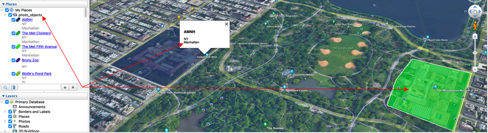
The script will look for objects in this folder.

In `Google Earth Pro`, you can create 2 types of objects that are used by the script:
### Polygon
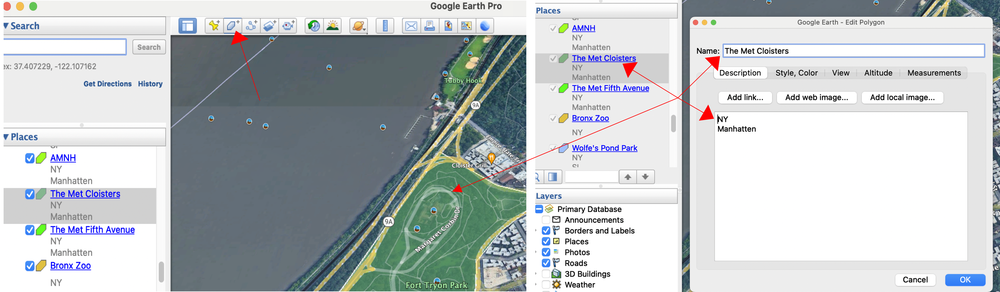

In the polygon, you should specify the name of the polygon and a list of tags in the comments field.

### Placemark
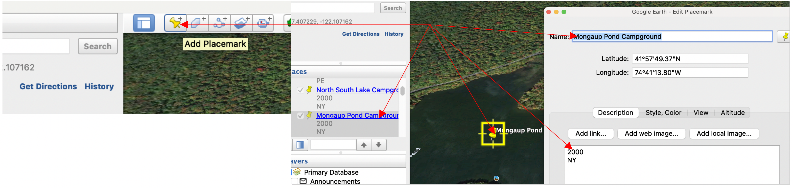
You should specify the placemark name and a list of tags in the comments field. Each tag on a new line. The first line of placemark comments is the radius in meters. If the image is closer than this radius to the geo object, then the script will assume that the image is located in this object.
The `Google Earth Pro` application data is stored in the `'myplaces.kml'` file. The full path to this file should be specified in the  `'gogle_geo_object_kml_file_path'` configuration parameter. If the settings parameter `'gogle_geo_object_kml_file_path'` is empty, the script defaults to `'UserHomePath/Library/Application Support/Google Earth/myplaces.kml'`, where `UserHomePath` is the user's home directory.

## Clock calibration by reference photos
Often a situation arises when the exact time is not set in the camera or is not translated after moving to another time zone, or is lost when replacing batteries. In general, if the clocks on different devices are not synchronized, the photos in the folder will be mixed. If the filename template contains a time, the incorrect time will be displayed in the filename. Files with erroneous times will not be able to be geolocated by gpx tracks.

But if there is a geo-track recorded by a device that moved mainly with a photo / video camera, then it is possible to determine this error and correct it.

It's simple - you need to find a point on the track for a photo of a known place and calculate the difference that should be applied to all photos of this camera.

But in reality, it is not always possible to unambiguously find exactly the necessary nearest point on the track near the photo. Of course, to be sure, you need to take several photo and find the time shift value common to them. In theory, it's simple. But when we move on to practice, then on the track to find the “those” points seems to be a very “exciting” activity.

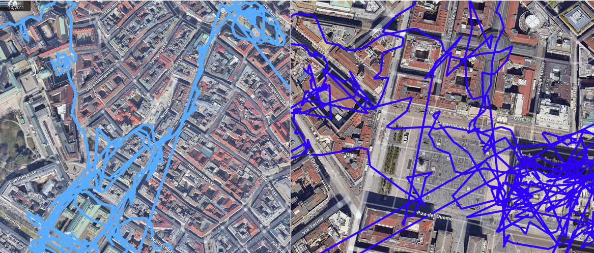

If the `'get'` settings parameter contains the value `'get_utc_calibrate_by_track'`, then for each of the found cameras without their own geolocation devices, an attempt will be made to calculate a time shift that compensates for the clock setting error. For such a calibration, it is necessary that some photo of the photo device without their own navigation have manually set coordinates and have a track that is very close to the route of the camera movement:

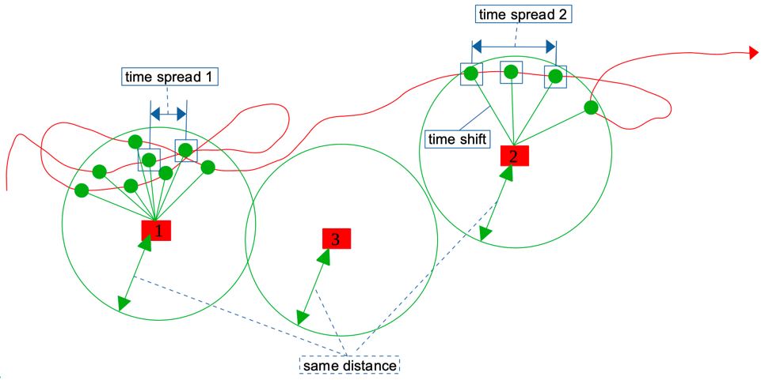
- 1, 2 and 3 are photographs with manually specified coordinates.
- Red line - track,
- Green dots - track points that are closer to the photo than a certain distance (we start the analysis with min_dist_delta)

For each Photo-Track Point pair, the time difference is found.
The script solves the problem, which consists in finding common value of this difference for a set of reference photos. This will be the desired error. The track points corresponding to the values of the time shift common for several reference photographs are circled in blue squares in the figure.
In fact, the track does not fully cover all the shooting locations at the time of shooting. Therefore, we will look for a common shift not for all reference photos, but for a certain minimum number - (`'min_files_num'`).
If for a given distance, for which the track points were selected for each photo, the total time difference for the minimum number of photo was not found, then we increase the distance (`'distance_step'`) and repeat until we reach an acceptable result or until we reach the maximum radius (`'max_dist_delta'`). An acceptable result will be the median value of the time shifts over the found common values, provided that the minimum spread (`'time_spread'`) of these values over all reference photographs does not exceed the value of the multiple time error:

    time_spread = min( time spread 1, time spread 2 … )
    time_spread < time_delta * num_time_delta_spread.

When searching for common time shift, the script doesn't make an exact comparison, but with a certain `'time_delta'` error, which is due to the fact that GPS devices do not record the track all the time, but with a certain time interval. The algorithm was tested on tracks that were recorded with an interval of 30 seconds. Tracks that were recorded in the distance change mode were not checked.
If upon reaching `'max_dist_delta'`, the optimal solution is not found, then the median value of the total time shift is taken as a solution, with a minimum spread without taking into account the condition time_spread < time_delta * num_time_delta_spread.
For this part of the script to work, the following parameters are provided in the settings:

    "utc_cal_by_multi_track": {
        "min_dist_delta": 5,
       "max_dist_delta": 50,
       "distance_step": 3,
       "min_files_num": 3,
       "max_files_num": 10,
       "time_delta": 60,
       "num_time_delta_spread": 2
    }

Sometimes it is convenient to place these parameters in the folder settings if the set of parameters is unusual and uncharacteristic for most situations. For example, if the search is carried out on one frame: `"min_files_num": 1` or the data is so bad that you want to at least approximately find at least something: `"time_delta": 200`.
If there are too many reference photos, then the script running time can increase without a significant increase in the quality of the result, so the number of analyzed reference photos is limited by `'max_files_num'`.

When finding the required time shift, the resulting figure is probably not intuitive: `{'NIKON_D300': 14492.5}`. This is due to the peculiarity of the algorithm. In reality, the algorithm looks for the difference between the camera clock and the UTC time of the track points.

## Calculation of coordinates by GPS track
In the current folder, the script looks for all files with the `.gpx` extension, load all the tracks except for the file with the name specified in the `‘exist_pv_gpx_track_file’` settings parameter setting, and geolocate all groups of files for which the UTC time of shooting is known and the coordinates are unknown.
If there is an exact match between the time of the photo and the track point, then we write the coordinates of this point into the photo. If we find two track points between which the moment of photographing is located on the timeline, then the coordinates of the photograph are calculated by interpolation:

    k = (photo_time - point_1_time) / ( point_2_time - point_1_time)
    latitude = point_1_lat + k * (point_2_lat - point_1_lat)
    longitude = point_1_lon + k * (point_2_lon - point_1_lon)
    altitude = point_1_lat + k * (point_2_lat - point_1_lat)

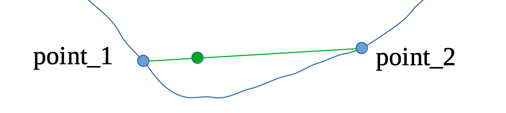

The blue line is the actual route of the GPS device.
Blue dots are dots in the gpx track.
The green dot is the group's calculated location.

In this case if settings parameter `'set'` contains the value `'exif_set'`, the value `'geo_track'` will be placed in the script data tag for the `'coord_source'` key.

## Calculation of tags from a full folder path
By storing files in folders with event names, this can be exploited by adding brief information from the full path to the files.
The regular expression specified in the `‘path_names_phrase_pattern’` settings parameter will allow you to select characteristic text fragments from the full path. These fragments can be used later as tags in the file. For example, if `"\\((.*?)\\)"` is specified as a pattern, then if parentheses are used in folder names, then all fragments in brackets will be selected and used as tags:

    folder: .../photo/2011/2011_(vacation)/2011_01_01-16_(Bormio)
    tags: 'vacation', 'Bormio'

## Filtering groups based on grouping by folders
When storing photos on a local drive, it's convenient to name folders that contain photos and videos according to the events they cover. For example: `'NewYork_2001_10_10-12'` or `'2006_10_20_(Paris)'` or `'2014_08_15_(Wedding)'`. In order to evaluate whether a particular file should be in this folder or if it got here by accident, a grouping attribute was created.
If the file creation date is, May 20, 2010, then using the `'folder_dt_name_format'` setting containing, for example, `'%Y_%m'`, we get the value of the folder grouping attribute equal to `'2010_05'`. Accordingly, if the `'sort_files'` setting contains true and the name of the folder where this file is located does not contain the substring `'2010_05'` then a subfolder with the name `'2010_05'` will be created in the current folder and the file will be transferred to this subfolder.

## Calculation of the time zone by neighboring groups
To determine the UTC time of a group, group files coordinate are used, but if there are no coordinates and the time zone is not specified manually, then if the value of `'get_t_zone_by_neighbors'` is specified in the `'get'` parameter settings, the time zone will be determined by neighboring groups sorted by creation date obtained from EXIF.
For each group, the nearest preceding group and the nearest subsequent group containing the time zone information are searched. If thees tzones matches, then this t-zone put into the current group.

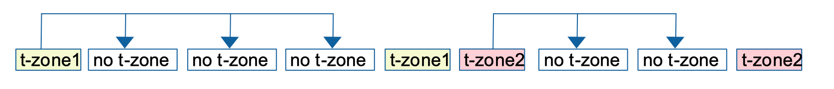

If the t-zone before group is not equal to the t-zone in the next group, then the user will be informed about this and this situation should be corrected manually. You will have to visually assess from the photo when the time zone change occurred and manually specify the correct time zones for the border groups. As a rule, this is not difficult - it is either an airplane flight or a car ride, which is easily tracked by photo.

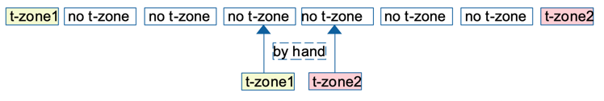

## Calculation of coordinates of groups by neighboring groups
If the `'get'` settings parameter contains the value `'get_coord_by_neighbors'`, then if there are still groups without coordinates in the folder, the script can determine their coordinates using groups with coordinates as a reference geo-track.

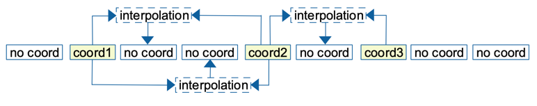

In this case if settings parameter `'set'` contains the value `'exif_set'`, the value `'geo_neighbors'` will be placed in the script data tag for the `'coord_source'` key.

## Get coordinates of groups at the beginning of the folder
Calculation of the coordinates of groups at the beginning of the folder by the first group with coordinates.
If the `'get'` settings parameter contains the value `'get_begin_coord_by_first_neighbor'`, then the coordinates from the first group of files with coordinates are applied to all groups preceding in time.

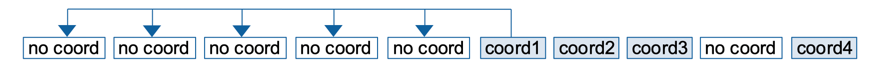

In this case if settings parameter `'set'` contains the value `'exif_set'`, the value `'geo_begin_end'` will be placed in the script data tag for the `'coord_source'` key.

## Get coordinates of groups at the end of the folder
Calculation of the coordinates of groups at the end of the folder by the last group with coordinates.
If the `'get'` settings parameter specifies the value `'get_end_coord_by_last_neighbor'`, then the coordinates from the last group of files with coordinates are applied to all later groups.

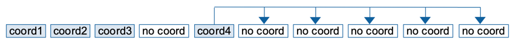

In this case if settings parameter `'set'` contains the value `'exif_set'`, the value `'geo_begin_end'` will be placed in the script data tag for the `'coord_source'` key.

## Calculation of median coordinates
If the `'get'` settings parameter specifies the `'get_median_coord'` value, then the median value is calculated for all groups with coordinates in the folder and put in to groups without geolocation.

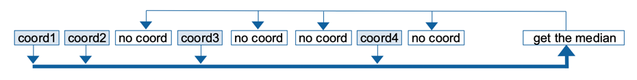

In this case if settings parameter `'set'` contains the value `'exif_set'`, the value `'geo_median'` will be placed in the script data tag for the `'coord_source'` key.

## Application of single manual data for all groups without coordinates or without time zone
If the value `'get_common_data_from_manual_file'` is specified in the `'get'` settings parameter, then in the current folder the script is looking for a file with the name specified in the `'manual_data_file'` parameter. In this file, the script is looking for the key 'All' and its value with coordinates or/and a time zone:

    All|40.76872140006278, -73.980028562252 | alt 100

or

    All |40°46'20.0"N 73°58'23.7"W | America/New_York   ← Only coordinates will be applied

or

    All | America/New_York

If coordinates are specified for `‘All’`, then all groups without coordinates will be found and coordinates from the `‘All’` setting will be written in them.

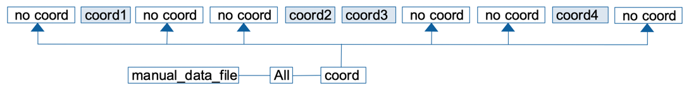

In this case if settings parameter `'set'` contains the value `'exif_set'`, the value `'geo_common'` will be placed in the script data tag for the key `'coord_source'`.

If only the time zone is specified for `'All'`, then all groups without a time zone will be found and the time zone from the `'All'` setting will be assigned to them.

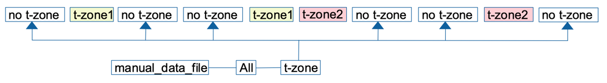

## Calculation the address by coordinates
If the `'get'` settings parameter specifies the `'get_address'` value, then for all groups with information about the geolocation, the script calculates the postal address.
At the beginning of the processing, loading a file is with a saved cache of previously defined addresses. The cache is stored in a file whose path is specified in the `'addr_cache_pickle_file_path'` configuration parameter. If the path is not specified in the settings, then the default value `'data/pvs_address_cache.pickle'` is taken.
Address search is carried out step by step in the order specified in the settings parameter `'address_source_ordered'`:

    "address_source_ordered": [
        "cache",
        "osm"
    ]

If at the previous stage the search did not give results, then the search continues in other ways, otherwise the search ends.
### Search in the Cache
From the `'address_cache_delta'` settings parameter, the accuracy of the address lookup in the cache is determined. Address in the cache is searched by coordinates that is closer to the desired coordinates than the accuracy specified in `‘address_cache_delta’`.

### Search in the public service OpenStreetMaps 
To access OpenStreetMaps, fill in the `'osm_user_agent'` settings parameter with some name.
From the received address, only the fields specified in the `'addr_parts_types'` configuration parameter are left.
When correctly getting an address from OpenStreetMaps, the 'source' field and the value 'osm' are added to the address.
Each new address from OSM is stored in the address cache.

At the end of processing each folder, the cache data is saved back to the `'addr_cache_pickle_file_path'` file.

If you suspect that the cache has become out of date, it is possible to run an update of all addresses in the cache: 
> python3 pvs.py tool -upd_cache

To completely update the cache, you can delete the cache file, and it will be created anew during the next systematization.

### Geo_point
There are coordinates where there are no postal addresses, for example, on the high seas. To exclude regular attempts to determine a non-existent address, the `'use_geo_point'` settings parameter has been added. If `'use_geo_point'` is set to true, in this situation the script saves as the address:
{'geo_point': '41.924504600097215 18.587305756478003'}

## Search for geo objects by group coordinates
For each group with known coordinates, the corresponding geo_objects are searched.
All `'Polygons'` inside which the group coordinates fall and all `'Placemarks'` that are closer to the group than the distance specified in the first line of the `'Placemarks'` comments are found.

Tags from these geo_objects can be used when filling in the tags of the files in the group.

At the moment, this information is loaded from the local `'Google Earth Pro'` application.

## Reading and making changes to the metadata section of files
Parallel data processing is used to speed up saving data in metadata sections of files. The number of processes to start is determined by the `'num_multi_processes'` setting.

If the `'set'` setting parameter contains the value `'exif_set'`, then metadata section of each file of each group stores a portion of the computed file information. To preserve the original metadata as much as possible, all the necessary information, except for the coordinates, is stored in one tag with the name from the `'script_data_tag_name'` settings parameter.
### Script data
Tag with name from `'script_data_tag_name'`.
The list of script data [stored](readme.md#Storing-script-data-in-media-files) in file media tag:

- Version of the script by the key 'pvs'. `'pvs'`
- The original and unchanged date and time of the photo/video. `'first_dt'`
- Local date and time of photo / video shooting. `'dt'`
- Type of local date and time of photo / video shooting. `'dt_type'`
- Source of current date and time of photo/video shooting. `'dt_source'` 
- Time zone of the shooting location. `'t_zone'`
- UTC time of shooting. `'utc_dt'`
- Source of information about the coordinates of the shooting location. `'coord_source'` The most important setting. If it contains a value, a decision is made that the coordinates in the file were not originally in it, but were calculated by this script and can be changed or deleted without losing the original information. When changing the geolocation of the file, a check is made for the presence of information about the source of coordinates. If the information about the source of coordinates is not filled in, and the coordinates are known, then the script will not make changes to the geolocation data.
- Postal address calculated from the coordinates of the shooting location. `'address'` The `'source'` field has been added to the address, which stores information about the sources of information about the address.
- Information with a capture device alias. `'camera'`
- Unique group number calculated by the script. `'gr_id'`
- Unique file number calculated by the script. `'f_id'`
- The value of the tag that it contained before it was used as a script data store. `'prev_value'`
- Time offset after time shift is applied during clock calibration. `'dt_offset'`

Since the tag selected in the `'script_data_tag_name'` setting can be stored in tags with different names in different types of files, when reading script data from a file, by analogy with the date and time, it is read from the list from the `'EXIF_script_data_tag_names'` settings parameter. The first correct match is considered to be the searched data value of the script. The search is carried out in the order they appear in the list, so the most likely options are listed first. For example: `'UserComment'` is stored in different file types in `'EXIF:UserComment'` or in `'XMP:UserComment'`.

### EXIF geolocation data
Latitude, longitude, altitude.
Particular attention is paid to saving the original coordinates in files - we write the coordinates to the file or delete them from the file only if these are coordinates that were previously calculated by this script. A sign of such coordinates is the `'coord_source'` parameter specified in the script data tag. This restriction applies only to the `'sys'` systematization process, when using the `'tool'` utilities, coordinates can be deleted regardless of their origin.

## Creating macOS tags
If the `'set'` settings parameter specifies the value `'mac_tags_set'` and the MacOS operating system, then the script allows you to use the Finder tag mechanism to get a convenient, easy-to-read report on the result of its work.

Each tag option is configured separately:

    "mactag_coord_source": {    ← Tag name
        "active": true,         ← Activation flag
        "prefix": "% ",         ← Prefix to tag text
        "color": "NONE"         ← Tag color
    }

- `'active'` - determines whether this tag will be added to the file. If 'true' is specified, it will be added.
- `'prefix'` - The text specified here will be displayed before the main text of the tag.
- `‘color’` is one of the following colors: "NONE", "GRAY", "GREEN", "PURPLE", "BLUE", "YELLOW", "RED", "ORANGE"

The tags are added to the file in the order specified in the `'mactag_order'` configuration parameter:

    "mactag_order": [
        "mactag_address",
        "mactag_no_coord",
        "mactag_coord_source",
        "mactag_folder_dt_format",
        "mactag_path",
        "mactag_geo_object",
        ...
    ]

Attention! For a tag to be added to a file, 3 conditions must match:
1. The main condition for applying the tag has been met. Each tag has a unique condition.
2. The `'active'` key of the tag's configuration parameter corresponds to the value `'true'`.
3. The tag name is listed in the `'mactag_order'` list.

Before adding tags, the file's tag list is cleared. Only those tags that start with the characters specified in the `'mactag_keep_signs'` parameter setting are kept.

### List of possible macOS tags
- `'mactag_coord_source'` Source of file coordinate information. One of the values: `'by_hand'`, `'geo_begin_end'`, `'geo_track'`, `'geo_neighbors'`, `'geo_median'`, `'geo_common'`. If the coordinates are original and not calculated, the tag will not be written to the file.
- `‘mactag_no_coord’` No coordinates in the group.
- `'mactag_address_source'` Source of address information.
- `‘mactag_folder_dt_format’` Grouping flag from the filtering section.
- `'mactag_path'` [Tags](readme.md#Calculation-of-tags-from-a-full-folder-path) from the full path of the folder.
- `'mactag_geo_object'` Tags from [geo_objects](readme.md#Search-for-geo-objects-by-group-coordinates) found by group coordinates.
- `'mactag_address'` Postal address. If the settings parameter `'set'` doesn't contain the value `'addr_if_obj_to_mac_tag'` and the `'mactag_geo_object'` tag is added, no address tags are added.
- `'mactag_geo_point_address'` Flag for the Geo_point as address.
- `'mactag_no_exif_dt'` Indicates that the date is determined by the file date, not by EXIF.
- `'mactag_camera_key'` Camera alias.
- `'mactag_no_address'` Sign of the absence of an address when the coordinates are filled.
- `'mactag_datetime_offset'` Value of time offset after time shift is applied during clock calibration.
- `'mactag_no_utc_datetime'` Flag for missing UTC time.
- `'mactag_utc_datetime'` UTC date and time value
- `'mactag_no_t_zone'` Flag for the absence of a time zone.
- `'mactag_first_datetime'` First time value.
- `'mactag_creation_datetime'` Creation date and time value from EXIF.
- `'mactag_naming_datetime'` The value of the date and time used to form the kernel name.
- `'mactag_sort_key'` The value of the special sort field.
- `'mactag_naming_datetime_warning'` Warnings raised while naming the file.

## Computing a new filename and rename
### Name core
When calculating the name of files, the script first gets the core of the name, which is the same for all files in the group. The `'name_core_format'` settings parameter loads the datetime-based name core template.
If it was not possible to determine the UTC date and time of creation for the group, then we use the date and time that were read from EXIF as the date for naming.
If the UTC time of creation is known, then from the settings parameter `‘t_zone_naming’` the script determine how the files should be named depending on the UTC time:
- If `'t_zone_naming'` contains the value `'local'`, then the date for naming is obtained by converting UTC time to the local time zone for each group.
- If `'t_zone_naming'` contains the name of a specific time zone, then for all groups the date for naming is obtained by converting UTC time to local time for the specified group.

The core of the name is obtained by applying the template `'name_core_format'` to the given date for naming.

### Build a new file name
For each file in the group, the script calculates a new file name.
At the stage of loading for each file from the settings `'masters'`, `'slaves'`, `'non_pair'` and `'additions'` the following settings were obtained: `'prefix'`, `'suffix'`, `'ext'`
From the setting parameter `'new_name_order'` script gets the order of the elements when forming a new name:

    "new_name_order": [
        "num",              ← ordinal number of the group
        "prefix",           ← prefix for the new name,
        "name_core",        ← date-based name core
        "suffix"            ← suffix for the new name
    ]

The file name is formed by concatenating the number, prefix, name kernel and suffix in the order specified by the `'new_name_order'` parameter.
The extension for the new file is determined by the `'ext'` parameter previously loaded from the settings:
- If the `'ext'` parameter is empty, then the new extension is copied from the old filename.
- If the `'ext'` parameter contains text, then use it as the new extension.

According to the `'new_name_case'` setting, it is decided which letters the new file name will be written in - lowercase, uppercase or as it is:
- If `'new_name_case'` contains `'as_is'` then leave case unchanged.
- If `'new_name_case'` contains `'lower'` then convert the new name to lower case.
- If `'new_name_case'` contains `'upper'` then convert the new name to upper case.

### Rename first step
If the `'set'` settings parameter contains the value `'rename_set'`, all files from all groups are renamed. The new name consists of the computed new name and a special character attached to it, which is stored in the `'job_sing'` settings parameter.

### Rename second step
Clearing all filenames in the folder from the service substring from `'job_sing'`.
The same renaming second step mechanism is also run at the start of a job in each folder to clean up filenames from a possible unsuccessful previous run at the renaming step.

## Checking the results and printing them
If the `'log_mode'` settings parameter specifies the value `'result_log'` and/or `'result_print'`, then the last analysis of the results is output to the log and/or screen based on the parameters.
  - if the `'results_check'` settings parameter contains the value `'no_address_with_coord'` - printed all groups with coordinates but no address
  - if the `'results_check'` settings parameter contains the value  `'no_UTC_datetime'` - printed all groups for which UTC time could not be determined
  - if the `'results_check'` settings parameter contains the value `'no_coord_with_utc_time'` - printed all files for which it was not possible to determine the coordinates for a known UTC time.

## Logging.
The script provides a custom logging and display mechanism:

    INFO main 2017:07:20-10:21:22 PVS process started.
    INFO main 2017:07:20-10:21:22 === Start working on ===: /Users/User1/tmp/111
    INFO stage 2017:07:20-10:21:22 /Users/User1/tmp/111: Start cleanup after rename.
    …

By default, the log file is located in the `'data'` folder: `'data/pvs_report.log'`. The location of the log file can be changed by specifying its path in the `'log_file_path'` configuration parameter.
The settings parameter `'log_mode'` specifies all stages that can be configured individually:

    "log_mode": [
        "counterprint",
        "rename_log",
        "-rename_print",
        …
    ]
Elements ending in `'_print'` are responsible for printing in the terminal.
Elements ending in `‘_log’` are responsible for saving to the log.

Deactivation of each setting element is carried out by the sign '-', indicated in front of the parameter.
- `"counter_print"` - printing on the screen a progress counter.
- `"rename_log"`, `"rename_print"` – the process of renaming files.
- `"address_log"`, `"address_print"` – the process of obtaining postal addresses by group coordinates.
- `"coord_log"`, `"coord_print"` – determination of the group's new coordinates.
- `"t_zone_log"`, `"t_zone_print"` – getting information about the time zone.
- `"datetime_log"`, `"datetime_print"` – adding the creation date and time to the group.
- `"calibr_log"`, `"calibr_print"` is the process of finding a time shift to correct a camera clock error.
- `"cal_w_p_log"`, `"cal_w_p_print"` - display the details of the time shift search.
- `"upd_addr_cache_log"`, `"upd_addr_cache_print"` – address cache update process.
- `"stage_log"`, `"stage_print"` – stages of the process.
- `"main_log"`, `"main_print"` - main messages
- `"result_log"`, `"result_print"` - displaying information on the results of the work.
- `"tool_log"`, `"tool_print"` – information about the operation of utilities.

The `'max_log_size_mb'` parameter specifies the size in MB at which the log file will be divided into separate files.

# Tools
Using the photoVideoSystemize script as a tool. Run with 'tool' command.
## Tools parameters
`-rec` After the tool ends in the current folder, the same mechanism is recursively run for all child folders, except for those folders whose name begins with the string specified in the `'ignore_sing'` configuration parameter.

`-rec_all` After the tool ends in the current folder, the same mechanism is recursively run for all child folders, unlike `-rec`, the launch is carried out for all folders without taking into account `'ignore_sing'`, which is reset to `''` for the current run.

`-no_rec` Prohibit recurrent run. Set the `'recurrent'` parameter in the settings to the `false` for the current run.

If `-rec`, `-rec_all`, `-no_rec`  parameters are not specified, The script decides whether to process child folders based on the settings of the ' recurrent' and ' ignore_sing' parameters.

`-cams <camera_name1> <camera_name2> ...` To run the script, you need to specify the names of photo / video devices: `-cams iPhone12_1`. If you need to apply the script to all groups / files without relatively specific devices, then the word All is indicated: `-cams All`
If the camera name consists of several words, then it should be quoted: `-cams ‘NIKON D300’`

`-report_type` | `-rt` if the tool provides this parameter, then the result of the work of this utility provides 2 output options:
- when specifying the values of the parameter 'all' or 'a', all found pairs of values will be printed on the screen and/or in the log: 
`the value of the parameter under study` - `the full file path`
- when specifying the values of the parameter 'unique' or 'u', all unique values of the parameter under study will be printed on the screen and/or in the log, indicating the number of occurrences.
- If the parameter is not specified, it defaults to 'unique'.

## Tools list
- Print all EXIF information of a specific file:
    > python3 pvs.py tool <file_path> -exif [-pickle_file_path |-pf {<pickle_file_path> | d | default}]

    > python3 pvs.py tool '/Users/UserName/tmp/123/123.jpg' -exif
    
    > python3 pvs.py tool '/Users/UserName/tmp/123/123.jpg' -exif -pf d
    
- Change individual EXIF tag of a specific file:
    > python3 pvs.py tool <file_path> {-add_exif_tag | -aet}> < tagName> < tagValue>

    > python3 pvs.py tool <file_path> -add_exif_tag EXIF:Make 'NIKON CORPORATION'

- Remove geolocation information from the file:
    > python3 pvs.py tool <file_path> -del_coord

    > python3 pvs.py tool '/Users/UserName/tmp/123/123.jpg' -del_coord

- Remove information about geolocation from all files of the folder:
    > python3 pvs.py tool <folder_path> -del_coord [-cams {<camera_name> | All}] [-rec | -rec_all | -no_rec]

    > python3 pvs.py tool '/Users/UserName/tmp/123' -del_coord -cams NIKON_D300 -no_rec

    > python3 pvs.py tool '/Users/UserName/tmp/123' -del_coord -cams All

- Remove all metadata from a file or files in a folder. The usage is similar to removing coordinates.

    > python3 pvs.py tool <file_path> -erase_exif

    > python3 pvs.py tool <folder_path> -erase_exif [-cams {<camera_name> | All}] [-rec | -rec_all | -no_rec]

- [Rebuild gpx track/tracks](readme.md#Rebuild-gpx-tracks)
    > python3 pvs.py tool {<file_path>  | <folder_path> } {-gpx_rebuild | -gpx_re } [-gpx_d <int_value_distance>] [-gpx_t <int_value_time_difference>] [-gpx_f <str_value_new_gpx_file_name>] [-gpx_merge]
  
- Full update address cache:
    > python3 pvs.py tool -upd_cache
 
- Print all available t-zones:
    > python3 pvs.py tool -tzones

- Create [pre-read](readme.md#Pre_read-data-for-analysis) data file for analysis.
    > python3 pvs.py tool <folder_path> {-data2pickle | -d2p} [-pickle_file_path |-pf {<pickle_file_path> | d | default}] [-rec | -rec_all | -no_rec]

- To see the camera information for each file, retrieved from the 'EXIF_camera_id_tags_names' list:
    > python3 pvs.py tool <folder_path> -cam_data [ -rec | -rec_all | -no_rec ] [ { -report_type | -rt} { all | a | unique | u } ] [-pickle_file_path |-pf {<pickle_file_path> | d | default}]

    > python3 pvs.py tool /Users/UserName/tmp/123 -cam_data -no_rec -rt a

    > python3 pvs.py tool /Users/UserName/tmp/123 -cam_data -no_rec -rt u -pf /Users/UserName/tmp/photo.pickle

    > python3 pvs.py tool /Users/UserName/tmp/123 -cam_data -no_rec -rt u -pf d
  
- Find out which cameras can be determined with the current settings in a specific folder, you can start the process of collecting data on used cameras:
    > python3 pvs.py tool <folder_path> -cam_ok [ -rec | -rec_all | -no_rec ] [ { -report_type | -rt} { all | a | unique | u } ] [-pickle_file_path |-pf {<pickle_file_path> | d | default}]

- Find out in which files it was not possible to determine the camera by the settings, you can start the process of collecting data on used cameras that do not match the current settings:
    > python3 pvs.py tool <folder_path> -cam_not [ -rec | -rec_all | -no_rec ] [ { -report_type | -rt} { all | a | unique | u } ] [-pickle_file_path |-pf {<pickle_file_path> | d | default}]

- To analyze a set of file tags, it is possible to get all possible variants of tags, which include one of the strings given in the "-exif_tags" parameter as a substring:
    > python3 pvs.py tool <folder_path> -exif_tags <string1> <string2> … [ -rec | -rec_all | -no_rec ] [ { -report_type | -rt} { all | a | unique | u } ] [-pickle_file_path |-pf {<pickle_file_path> | d | default}]

    > python3 pvs.py tool /Users/UserName/tmp/123 -exif_tags UserComment -no_rec -report_type all

    > python3 pvs.py tool /Users/UserName/tmp/123 -exif_tags UserComment Model Make -pf d

- [Examples of file types.](readme.md#Examples-of-file-types) If there is a need to find out what types of files are present in a particular folder system, it is possible can use a utility that goes recursively through all subfolders and copies 1 file of each type to a separate folder:
    > python3 pvs.py tool <folder_path> { -all_file_types | -at } [ -rec | -rec_all | -no_rec ] [ {-target_folder_path | -t_folder} <target_folder_path> ]
  
## Pre_read data for analysis
When executing some utilities, it is necessary to read data from many files and/or many folders. To save time, data about files of interest can be uploaded to a temporary file with the name specified in the `{-pickle_file_path | -pf}`. If the `-pf` parameter is not specified (when creating a file) or specified with the value 'd' or 'default' (when reading), then the script takes the value of the path to a temporary file with data about media files from the settings parameter `'files_data_pickle_file_path'`. If the parameter is also empty, then the default value is taken: 'pvs_files_data.pickle' in the 'data' folder.

To use a temporary file, it is possible use the `'-data2pickle'` tool, specifying the folder and the need for recurrent download. If the file already exists at the specified path, then when the file is created, the existing one is overwritten.

It should be remembered that if you change the photo / video files themselves or their composition, the temporary file described above will become irrelevant and will require re-creation for further use.
When the description of any other utility mentions the `-pickle_file_path` option, or `-pf` for short, the data source for the utility is the file previously created by the `'-data2pickle'` utility. If `-pf` is not specified, the utility will reload the appropriate data.
Examples:
Create data file from folder1 and all subfolders. Put result pickle file to the default place:
> python3 pvs.py tool folder1 -d2p -rec

Create data file only from folder2. Put result pickle file to the path1:
> python3 pvs.py tool folder2 -d2p -no_rec -pf path1

## Examples of file types
If the `-target_folder_path` parameter is not specified, then the folder where to copy files is determined from the `'all_types_folder_path'` settings parameter. If the path to the folder is not specified in the settings, then the default value is used: the `'pvs_all_file_types'` folder inside the data folder.
Next, 3 child folders with names are created in the found folder:
- 'media_files' – examples of files with types from the "media_types" settings list are copied into it
- 'add_files' – examples of files with types from the "add_types" settings list are copied here
- 'not_in_settings' - examples of files of all other types are copied here.

You should be careful if there are very large files in the folders. One of them may get copied.

## Rebuild gpx tracks
If there are several devices that moved very close to each other on the track. If there is a need to create one file from several gpx files of one device, divided into tracks inside. If the splitting into tracks of an existing file does not satisfy the requirements. For all these cases, it is possible to rebuild the gpx track.

Example 1. Rebuilding the track contained in the track_2006_10.gpx file with the parameters specified in the settings file:
> python3 pvs.py tool track_2006_10.gpx -gpx_rebuild
        
Example 2. Rebuilding tracks contained in all files of the `~/tracks/2010_12` folder with parameters 1000 meters, 1800 seconds and a file with the results in the same `'track.gpx'` folder:
> python3 pvs.py tool ~/tracks/2010_12 -gpx_re -gpx_d 1000 -gpx_t 1800 -gpx_f track.gpx

Parameters:

`-gpx_d` `Distance between` adjacent points in meters. If the parameter is not specified, then the value is taken from the settings parameter `'gpx_track_rebuild'` → `'distance_delta'`. If it is also not specified, that is, the settings contain the value `0`, then the default value is `1000 meters`.
`-gpx_t` `Less distance time delta`. The time interval for the distance is less than the parameter `-gpx_d`. The difference between UTC time of neighboring points in seconds. If the parameter is not specified, then the value is taken from the settings parameter `'gpx_track_rebuild'`→ `'less_dist_time_delta'`. If it is also not specified, that is, the settings contain the value `0`, then the default value is `21600 seconds`.
`-gpx_f` Results file name. If the parameter is not specified, then the value is taken from the settings parameter `'gpx_track_rebuild'` → `'new_gpx_file_name'`. If it is also not specified  in settings and the input path was a folder then the default value is `'_track.gpx'`. If it is not specified in settings and the input path was a specific file, then the default value is `'_re_'+ the name of the input file`.
`-gpx_merge` If this parameter is specified when starting the tool, then all points sorted by time are stored in the result as one track without splitting. If this parameter is not specified then the setting parameter `'gpx_track_rebuild'` → `'merge'`. If this parameter is not specified then the script will check setting parameter `'gpx_track_rebuild'` → `'merge'`, and if the settings parameter  contains  `'true'`, then also the result will be one track.

In the case of input data as a file, script loads the specified file.
If specify a folder as the route data source, all files with the .gpx extension will be loaded from the specified folder, except for the file with the name specified in the `'exist_pv_gpx_track_file'` settings parameter.

All points of all loaded tracks are collected in one 'heap' and sorted by UTC time, registered at each track point.
Further, all points are divided into separate tracks. The script goes through all the points and compares them in pairs. Splitting into separate tracks occurs when one of the following conditions is met:

1. If the distance between points is greater than the `Distance` parameter.
2. If the distance between the points is less than the Distance parameter, and the time difference is greater than the `Less distance time delta`.

At the end of the script, the new navigation data is saved to a file in the current folder.

# Development
## Passing tools parameters
When using script elements as separate tools, it is possible to pass settings as a parameter to the `__init__` method of the `PVS` class. ' manual_settings' and ' mode_preset_list' apply in any combination.
> pvs_tool = PVS(manual_settings=params, mode_preset_list=par_mode)

or use settings only from parameters file:
> pvs_tool = PVS()
 

`params` - parameters in dictionary format according to the parameter structure of the 'pvs_settings.json' file. The order of using params is described in paragraph 2 of the description of the [Settings](readme.md#Settings).

Example:
    
    params = {
              "num_multi_processes": 5,
              "media_types": ["NEF",
                            "DNG",
                            "jpg",
                            "jpeg",
                            "PNG",
                            "TIF",
                            "TIFF"]
              }

`par_mode` - a list of names of parameter sets that can be specified in advance in the `'pvs_mode_preset.json'` file in the `'data'` folder. The order of using params is described in paragraph 4 of the description of the [Settings](readme.md#Settings)..

Example:

    par_mode = ['exact_get', 'only_rename']

Next, call the activate_tool() method:
> pvs_tool.activate_tool()

The method returns True if the activation was successful and the settings were loaded and checked for correctness, or False if an error occurred while checking the settings. Examples of using parts of script as separate tools can be found in the `'pvs.py'` file.

## Ideas for possible further expansion of functionality
- Add a test module.
- Add automatic upload to one or more cloud photo services.
- Add a parameterized stage to the `'sys'` systematization or a separate `'tool'` that will write to the file previously calculated and verified data on the time of creation and geolocation of the photo, clearing some of the features from script data in file tag, which indicate the artificiality of data on geographic coordinates and the time of shooting.
- Add additional sources of geo-tracks in addition to gpx files.
- Add additional ways to enter manual information.
- Add additional sources of geo_objects in addition to the GoogleEarthPro file. For example GeoJson.
- Add additional sources of addresses in addition to the OpenStreet Maps service. For example Google.
- Add a mechanism to correctly change the `'script_data_tag_name'` field.